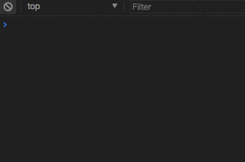

# webpack-disable-installedModules

I create main.js to load built js file dynamically and execute it whenever the file is loaded again. 

```
function loadJS (file) {
  console.log('loadJS...')
  let scripts = Array.from(document.querySelectorAll('script.main'))
  scripts.forEach(script => script.remove())

  let script = document.createElement('script')
  script.setAttribute('class', 'main')
  script.src = file
  
  document.body.append(script.cloneNode())
}
setInterval(() => loadJS('./scripts/bundle-pageA.js'), 1000)
```

There are two config files for webpack to build. 

The one with [CommonsChunkPlugin](https://webpack.js.org/plugins/commons-chunk-plugin/) behaves as I expect.




but the other one without 
CommonsChunkPlugin behaves different which only loads the file and doesn't execute.
