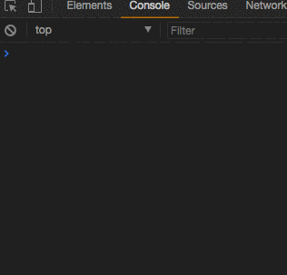

# webpack-disable-installedModules problem

I create main.js to load built js file dynamically and execute it whenever the file is loaded again. 

```
function loadJS (file) {
  console.log('loadJS...')
  let scripts = Array.from(document.querySelectorAll('script.main'))
  scripts.forEach(script => script.remove())

  let script = document.createElement('script')
  script.setAttribute('class', 'main')
  script.src = file
  
  document.body.append(script.cloneNode())
}
setInterval(() => loadJS('./scripts/bundle-pageA.js'), 1000)
```

There are two config files for webpack to build. 

The one without [CommonsChunkPlugin](https://webpack.js.org/plugins/commons-chunk-plugin/) behaves as I expect.


But the other one with CommonsChunkPlugin behaves different which only loads the file and doesn't execute again.



## The Reason

The Reason I found is that the build [bundle-vendor.js cache the module and doesn't run the module again](https://github.com/AaronFlower/webpack-disable-installedModules/blob/3a41f9d643ef2fb3577762157ff033d40f80fa1c/dist-with-commons-chunk/scripts/bundle-vendor.js#L44). 

```
/******/    // The require function
/******/    function __webpack_require__(moduleId) {
/******/
/******/        // Check if module is in cache
/******/        if(installedModules[moduleId]) {
/******/            return installedModules[moduleId].exports;
/******/        }
/******/        // Create a new module (and put it into the cache)
/******/        var module = installedModules[moduleId] = {
/******/            i: moduleId,
/******/            l: false,
/******/            exports: {}
/******/        };
/******/
/******/        // Execute the module function
/******/        modules[moduleId].call(module.exports, module, module.exports, __webpack_require__);
/******/
/******/        // Flag the module as loaded
/******/        module.l = true;
/******/
/******/        // Return the exports of the module
/******/        return module.exports;
/******/    }   
```


** So, I want to ask do I use CommonsChunkPlugin properly and how to disable installedModules cache ?**,


